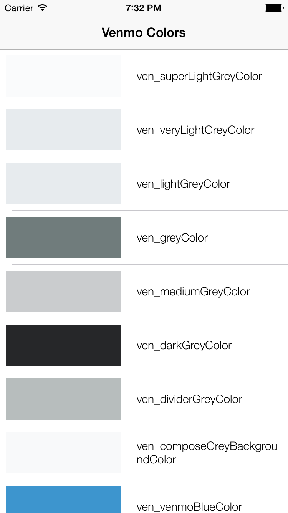

# Venmo iOS Colors
UIColors used in the Venmo app.

Adding and editing colors
-----------------------

#### 1. Add or make changes to colors in [UIColor+VenmoColors.h](https://github.com/venmo/venmo-ios-colors/blob/master/Colors/UIColor%2BVenmoColors.h) and [UIColor+VenmoColors.m](https://github.com/venmo/venmo-ios-colors/blob/master/Colors/UIColor%2BVenmoColors.m)
#### 2. Run the sample app on simulator or device. A list of the most up to date colors and their names will be loaded. Verify these are correct.

#### 3. Create a new github release, and update the podspec accordingly.

